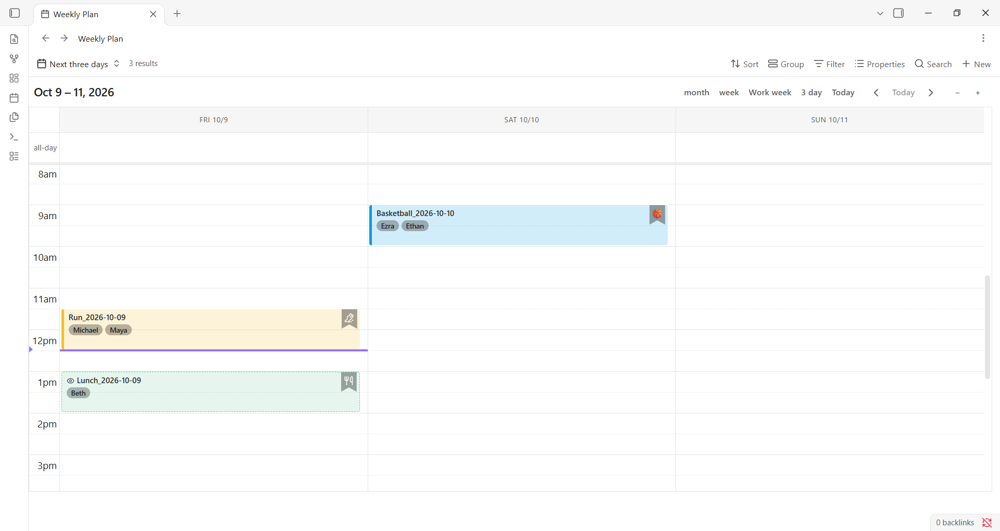
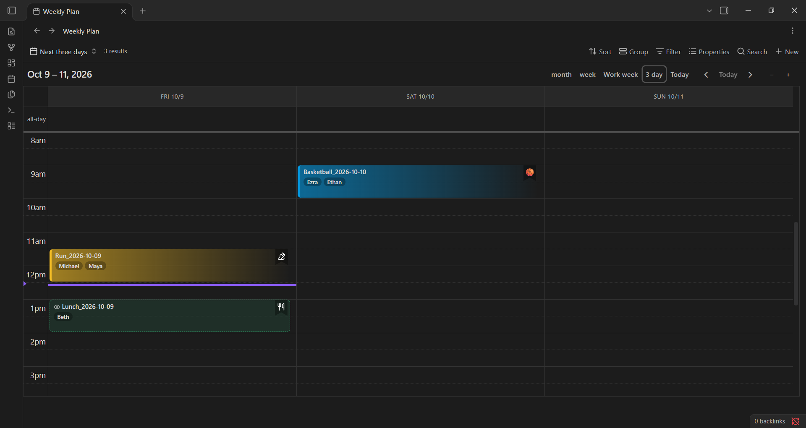
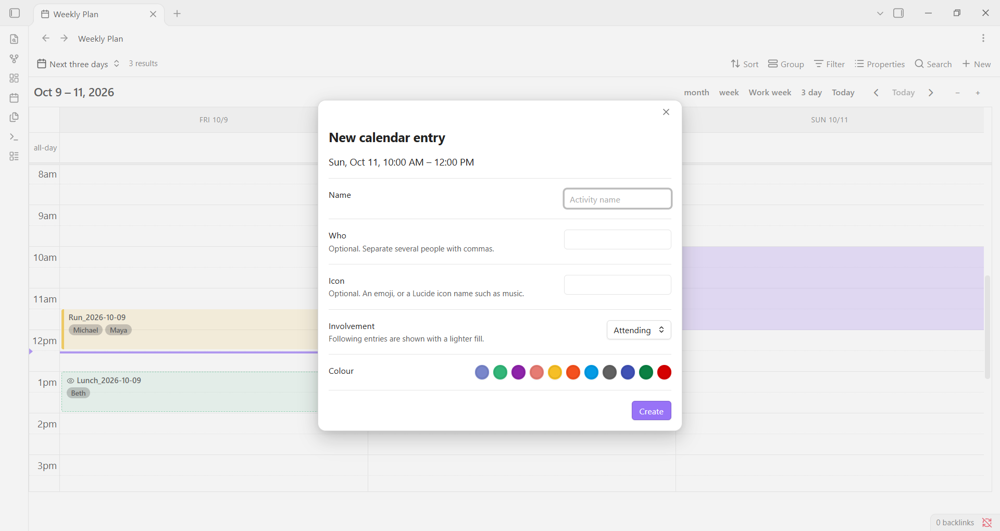

# Bases Calendar

This fork is maintained by [Mo van Vuuren](https://github.com/movanvuuren). It is based on [the original Bases Calendar plugin by mtellin](https://github.com/mtellin/obsidian-bases-calendar).

A calendar view for [Obsidian Bases](https://obsidian.md/bases) that displays your notes on an interactive calendar with multiple time views, Google Calendar–style event colors, and support for timed events.

> [!NOTE]
> This is 100% vibe-coded software built for personal use. It's shared in case
> it's useful to others — no guarantees it fits your setup, but I use and
> maintain it. If you run into a problem, open an issue and I'll try to address
> it.



> **Requires Obsidian 1.10 or later** (the version that introduced Bases).

---

## Features

- **Five view modes** — Month, Week (7-day), Work Week (Mon–Fri), 3-Day, and Today — switchable from the toolbar
- **Default view** — choose which of the five views the calendar opens on (e.g. 3 day) instead of always Work Week
- **Configurable default scroll position** — open time views at any hour (e.g. 8 AM) instead of midnight
- **Google Calendar colors** — assign named colors (Tomato, Sage, Peacock, etc.) to individual events via a frontmatter property
- **Timed events** — notes with a date-and-time value render in the correct hourly slot; date-only notes stay all-day
- **Detail property** — choose a secondary property (e.g. attendees, location) to display on the second line of each event
- **Drag-to-reschedule** — drag events to update their date/time frontmatter properties directly
- **Create entries from the calendar** — drag across time slots, or double-click a slot, to create a new note with its start and end filled in
- **People tags** — each person in the detail property is shown as its own small tag
- **Icon bookmark** — an emoji or [Lucide](https://lucide.dev/icons/) icon shown as a small bookmark in the top-right of an entry
- **Entry styles** — Tint, Glass, Gradient or Solid
- **Attending / following** — entries you only need to know about are shown with a lighter fill and an eye icon
- **Page Preview on hover** — hover over an event to preview the note without opening it



---

## Installation

This plugin is not listed in the Obsidian community plugin directory. Install it via BRAT (recommended) or manually.

### Via BRAT (recommended)

[BRAT](https://github.com/TfTHacker/obsidian42-brat) lets you install and auto-update plugins directly from GitHub.

1. Install the **Obsidian42 - BRAT** plugin from the Obsidian community plugins directory.
2. Open BRAT settings → **Add Beta plugin**.
3. Paste `movanvuuren/obsidian-bases-calendar` and click **Add Plugin**.
4. Enable **Bases Calendar** in **Settings → Community plugins**.

BRAT will notify you when new releases are available.

### Manual install

1. Download `main.js`, `manifest.json`, and `styles.css` from the [latest release](../../releases/latest).
2. In your vault, create the folder `.obsidian/plugins/bases-calendar/`.
3. Copy the three files into that folder.
4. Open Obsidian → **Settings → Community plugins** → enable **Bases Calendar**.

---

## Getting started

Create a `.base` file in your vault and add a `calendar` view. At minimum you need a `startDate` property pointing to the frontmatter field that holds each note's date.

```yaml
# Events.base
filters:
  and:
    - file.hasTag("event")

views:
  - type: calendar
    name: Calendar
    startDate: note.date
```

Any note tagged `#event` with a `date` frontmatter property will now appear on the calendar.

### Example note

```markdown
---
tags: [event]
date: 2026-06-10T14:00
endDate: 2026-06-10T15:30
color: peacock
icon: 🎯
involvement: attending
attendees:
  - Alice Chen
  - Bob Martinez
---

Quarterly planning session.
```

---

## View options

All options are configured through the **Properties** panel (gear icon) of a calendar view in your `.base` file.

### Date properties

| Option | Key | Description |
|--------|-----|-------------|
| **Start date** *(required)* | `startDate` | The frontmatter property holding the event start date or datetime. |
| **End date** *(optional)* | `endDate` | The frontmatter property holding the event end date or datetime. Multi-day events span across all covered days. |

### Event display

| Option | Key | Description |
|--------|-----|-------------|
| **Detail property** | `detailProperty` | A frontmatter property shown on the second line of each event. Supports multi-select/list values — shows up to 2 items and a `+N` badge for the rest. If left blank, falls back to the first non-title property in your view's column order. |
| **Icon property** | `iconProperty` | A frontmatter property holding an emoji (`🏏`) or a Lucide icon name (`music` or `lucide-music`). Shown as a bookmark in the top-right of the entry. Defaults to `icon` when not set. |
| **Involvement property** | `involvementProperty` | A frontmatter property whose value is `attending` or `following`. `following` entries are drawn with a lighter fill, a dashed border and a small eye icon. An empty value counts as attending. Defaults to `involvement` when not set. |
| **Color property** | `colorProperty` | A frontmatter property whose value sets the event color. Accepts a Google Calendar color name (see table below) or a `#RRGGBB` hex value. Events with no color value use the default theme style. |

### New entries

Used when you create an entry by dragging or double-clicking on the calendar. See [Creating entries](#creating-entries).

| Option | Key | Description |
|--------|-----|-------------|
| **Folder** | `newEntryFolder` | Where new notes are created. The folder is created if it does not exist. Leave blank for the vault root. |
| **Flag property** *(optional)* | `newEntryFlag` | A note property that is set to `true` on every new entry, such as `calendar`. Use it when your base filters on a checkbox property, so entries created from the calendar actually appear on it. |
| **Template note** *(optional)* | `newEntryTemplate` | A note whose content, including frontmatter, is copied into each new entry. Copied as plain text, so template-plugin syntax is not run. |

### Calendar options

| Option | Key | Default | Description |
|--------|-----|---------|-------------|
| **Entry style** | `entryStyle` | Tint | How entries are drawn: Tint, Glass, Gradient or Solid. See [Entry styles](#entry-styles). |
| **Default view** | `defaultView` | Work week | The view the calendar opens on: Month, Week, Work week, 3 day or Today. |
| **Week starts on** | `weekStartDay` | Monday | The first day of each week column in month and week views. |
| **Day starts at** | `scrollToTime` | 8:00 AM | The hour time views scroll to when first opened. You can still scroll up to see earlier hours. Available values: Midnight, 6 AM, 7 AM, 8 AM, 9 AM, 10 AM. |

---

## Google Calendar colors

Set a note's color property to any of these names (case-insensitive):

| Name | Preview |
|------|---------|
| `tomato` | Deep red |
| `flamingo` | Soft pink-red |
| `tangerine` | Orange |
| `banana` | Yellow |
| `sage` | Muted green |
| `basil` | Dark green |
| `peacock` | Sky blue |
| `blueberry` | Indigo blue |
| `lavender` | Soft purple-blue |
| `grape` | Purple |
| `graphite` | Dark grey |

In the default Tint style, colors render as a tint on the event background (stronger in dark mode) with a full-color left border, keeping text legible in both light and dark mode. Other [entry styles](#entry-styles) use the same color differently.

---

## Entry styles

Set **Entry style** in Calendar options. Each style uses the entry's color property.

| Style | Look |
|-------|------|
| **Tint** *(default)* | A subtle tint with a solid bar on the left edge. |
| **Glass** | Colour on the left fading out, with a blurred, translucent fill, a diagonal sheen on the right, and a bright top edge. |
| **Gradient** | Colour on the left fading out to the background, with a solid left bar. Text keeps the theme colour. |
| **Solid** | A flat fill in the entry's colour, with white or dark text chosen for contrast. |

Entries with no color use the theme's secondary background in every style.

---

## Icons and people

- **Icon.** An entry with an icon value shows it as a small bookmark ribbon in the top-right. A value that matches a Lucide icon name is drawn as that icon; anything else, such as an emoji, is shown as text.
- **People.** The detail property is drawn as small tags, one per person, with up to three shown and a `+N` badge for the rest. Link values (`[[Kiara van Vuuren|Kiara]]`) and plain lists both work.
- **Short entries.** Entries of 30 minutes or less put the title and people on one line so nothing is clipped. Entries of 20 minutes or less hide the people.

---

## Attending and following

Set the involvement property to `following` on entries you only need to know about, such as a child's training session you are not attending. They are drawn with a lighter fill, a dashed border in the entry colour and a small eye before the title, in every entry style. `attending`, or an empty value, gives the normal look.

---

## Creating entries

You can create a note straight from the calendar when the start (and end) date properties are note properties:

- **Drag** across time slots (or days in the month view) to choose a range.
- **Double-click** a time slot to create a one-hour entry, or a day in the month view or the all-day row for a one-day entry.

A dialog opens showing the date and time range and asks for:

| Field | Saved to |
|-------|----------|
| **Name** | The note's filename, `Name_YYYY-MM-DD.md`. A `_2` suffix is added if that name is taken. |
| **Who** *(optional)* | The detail property, or `person` if the detail property is not a note property. Several people can be separated by commas. |
| **Icon** *(optional)* | The icon property, or `icon`. |
| **Involvement** | The involvement property, or `involvement`. Attending or Following. |
| **Colour** | The color property, or `color`. A row of Google Calendar colour swatches; click one to choose it, and click it again to clear. The picker starts on the template's colour, if it has one. |

The note is created in the configured **Folder**, with the content of the **Template note** if one is set, then has its start and end properties written (a date for all-day entries, a date and time otherwise) and is opened. The range stays highlighted while the dialog is open and clears when it closes.

A single click does nothing, so dragging to select works normally. Two clicks on the same slot within 400 ms count as a double-click.

For entries to appear on the calendar after they are created, they must satisfy your base's filters. Either put the property your base filters on in the template, or set the **Flag property** option (for example `calendar`), which writes `true` to it on every new entry.

---

## Timed events

The plugin reads the time component of Obsidian date properties:

- **Date only** (`2026-06-10`) — rendered as an all-day event across the full day row.
- **Date + time** (`2026-06-10T14:00`) — rendered in the correct hourly slot in time-grid views (Week, Work Week, 3-Day, Today).

If both `startDate` and `endDate` have times, the event block spans the correct duration. All-day multi-day events (date-only start + date-only end) span across the covered days in the all-day row.

---

## Drag-to-reschedule

When `startDate` (and optionally `endDate`) are note properties (frontmatter), events are draggable. Dropping an event on a new date or time slot writes the updated value back to the note's frontmatter automatically.

- All-day events write back as `YYYY-MM-DD`.
- Timed events write back as `YYYY-MM-DDTHH:mm`.

Dragging is disabled when date properties come from computed or file-metadata sources (e.g. `file.ctime`).

---

## View modes

| Button label | View type | Description |
|---|---|---|
| month | `dayGridMonth` | Full monthly calendar grid. |
| week | `timeGridWeek` | 7-day time grid, all days. |
| Work week | `workWeek` | Mon–Fri time grid, weekends hidden. |
| 3 day | `threeDay` | Rolling 3-day time grid anchored on today. |
| Today | `timeGridDay` | Single-day time grid. |

The calendar opens on the **Default view** option. A view you pick from the toolbar is kept for as long as that calendar stays open, including across data updates, and is not carried over to the next time the base is opened.

---

## Development

```bash
git clone https://github.com/movanvuuren/obsidian-bases-calendar
cd obsidian-bases-calendar
npm install
npm run dev     # builds and watches; copies artifacts into test-vault/
```

Open `test-vault/` as a vault in Obsidian to test changes live. The build copies `main.js`, `manifest.json`, and `styles.css` into `test-vault/.obsidian/plugins/bases-calendar/` on every rebuild.

```bash
npm run build   # production build (minified, type-checked)
```

### Tech stack

- [Obsidian Plugin API](https://docs.obsidian.md/Plugins/Getting+started/Build+a+plugin) — `registerBasesView` for custom Bases views
- [FullCalendar 6](https://fullcalendar.io/) — calendar rendering (dayGrid + timeGrid + interaction plugins)
- React 19 — component layer
- esbuild — bundler

---

## License

MIT
